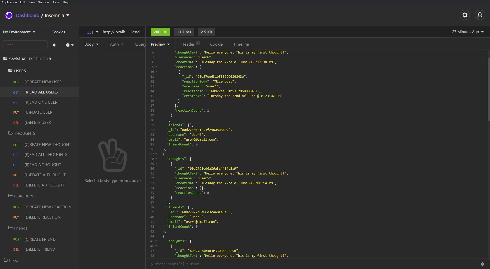

# Social API  
  

# Screenshot

# Description
A functional api for a social website

# Table of Contents
*[Demo](#demo)  
*[Technology](#technology)  
*[Features](#features)  
*[Installation](#installation)  
*[Usage](#usage)   
*[Questions](#questions)  
*[License](#license)

# Demo
[DEMO: Social API](https://drive.google.com/file/d/1zbynQNitVbKQ3Ug9AZtwBffVXmTqJj_O/view)

# Technology 
| Technology | Description                        |Links ↘️ |
| ---------- | -----------------------------------| ------|  
|  | Javascript |  |

# Features
MongoDB, Mongoose, Express

# Installation  
Project Repository: [Social API](https://github.com/iiTONELOC/social-api)  
Click on the link above.  
Clone the repo.  
After cloning navigate to the root and run `npm i` once the packages have installed run `npm run start` or `node server` to launch the server.  

# Usage
[Social API](https://github.com/iiTONELOC/social-api)  
There is no front end attached to this project, the routes can be tested with Insomnia or Postman. 

# Questions
Feel free to reach out if you have any questions

Contact via GitHub: [iiTONELOC](https://github.com/iiTONELOC)  

# License
MIT License

        Copyright (c) 2021 Anthony Tropeano
        
        Permission is hereby granted, free of charge, to any person obtaining a copy
        of this software and associated documentation files (the "Software"), to deal
        in the Software without restriction, including without limitation the rights
        to use, copy, modify, merge, publish, distribute, sublicense, and/or sell
        copies of the Software, and to permit persons to whom the Software is
        furnished to do so, subject to the following conditions:
        
        The above copyright notice and this permission notice shall be included in all
        copies or substantial portions of the Software.
        
        THE SOFTWARE IS PROVIDED "AS IS", WITHOUT WARRANTY OF ANY KIND, EXPRESS OR
        IMPLIED, INCLUDING BUT NOT LIMITED TO THE WARRANTIES OF MERCHANTABILITY,
        FITNESS FOR A PARTICULAR PURPOSE AND NONINFRINGEMENT. IN NO EVENT SHALL THE
        AUTHORS OR COPYRIGHT HOLDERS BE LIABLE FOR ANY CLAIM, DAMAGES OR OTHER
        LIABILITY, WHETHER IN AN ACTION OF CONTRACT, TORT OR OTHERWISE, ARISING FROM,
        OUT OF OR IN CONNECTION WITH THE SOFTWARE OR THE USE OR OTHER DEALINGS IN THE
        SOFTWARE.
        
